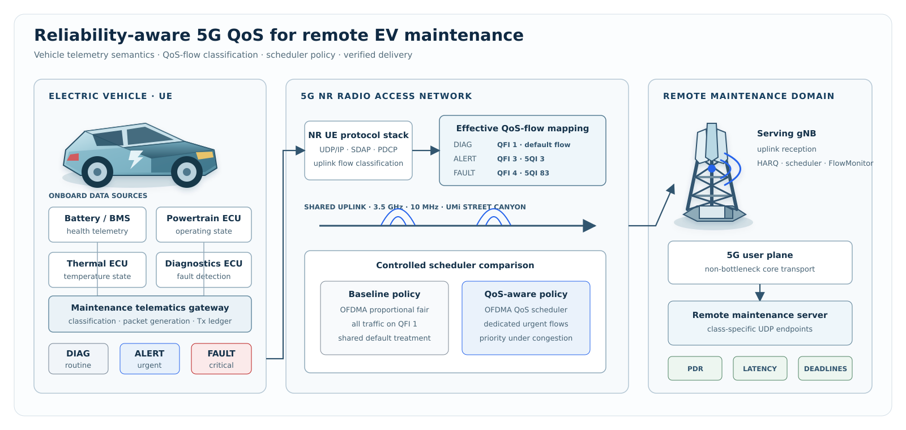
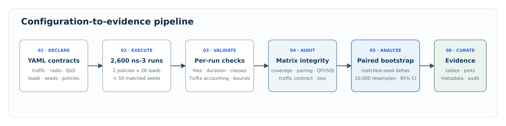
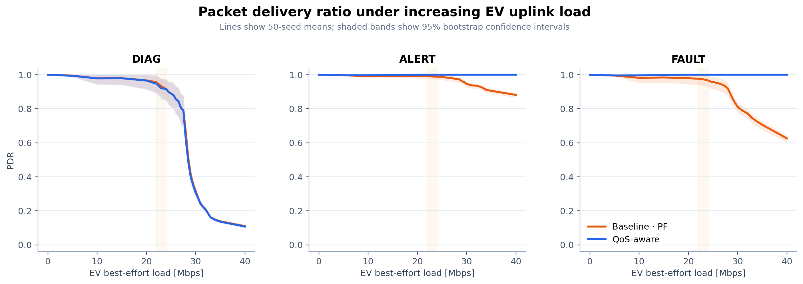
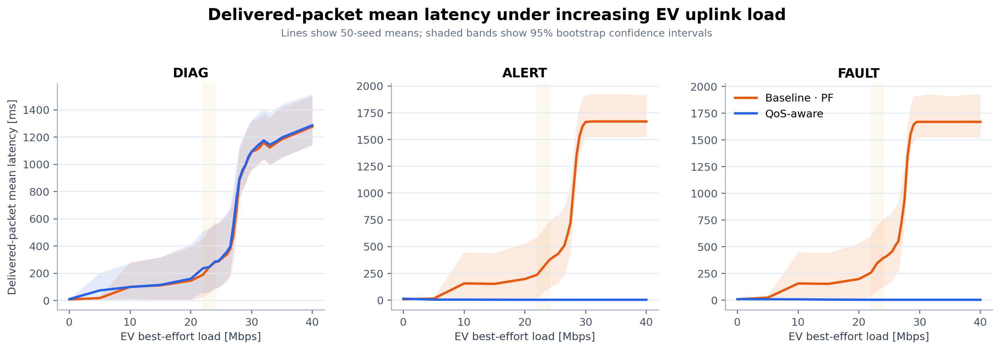
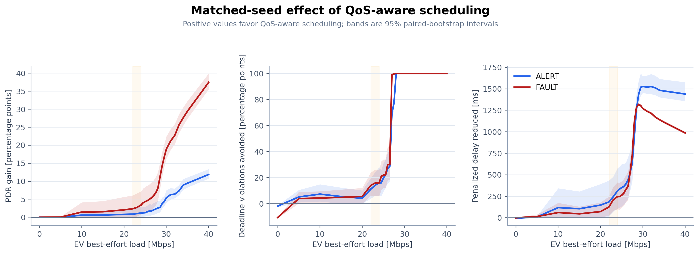

# Reliability-Aware 5G QoS for Remote EV Maintenance

[](https://www.nsnam.org/)
[](https://5g-lena.cttc.es/)
[](https://github.com/abdelrahman-fawaz18/ev-maintenance-5g-qos/actions/workflows/ci.yml)
[](#verification)
[](LICENSE)

An ns-3.47/5G-LENA v4.2 implementation of reliability-aware uplink scheduling for remote electric-vehicle maintenance. Three maintenance workloads—routine diagnostics, urgent alerts, and critical fault reports—share a congested 5G NR uplink with best-effort traffic. A controlled experiment compares proportional-fair default treatment with dedicated ALERT/FAULT QoS flows and a QoS-aware OFDMA scheduler.

> **Result.** Across the complete 0–40 Mbps load sweep, QoS-aware scheduling kept ALERT and FAULT delivery between **99.56% and 100%**, with mean delivered-packet latency below **13.2 ms**. As contention intensified, the baseline degraded first through rising latency and then through packet loss. Across the congested 28–40 Mbps region, baseline ALERT delivery declined from **97.42% to 88.12%** while mean latency rose from **1.04 s to 1.67 s**; baseline FAULT delivery declined from **91.94% to 62.53%** with mean latency between **1.34 s and 1.67 s**. Over the same region, QoS-aware ALERT and FAULT maintained **100% delivery** at approximately **3 ms** mean latency. DIAG degraded under both policies, confirming selective protection of urgent maintenance traffic rather than a uniform performance shift. Results are 50-seed means with 95% bootstrap confidence intervals and matched-seed policy comparisons.



## System design

| Traffic class | Function | Workload | QoS-aware mapping | Deadline |
|---|---|---:|---|---:|
| DIAG | Routine health telemetry | 1,136 B every 100 ms | QFI 1, default flow | 300 ms |
| ALERT | Abnormal-condition notification | 350 B, lognormal 100 ms mean IAT | QFI 3, 5QI 3 | 50 ms |
| FAULT | Detailed fault reporting | 1,056 B, lognormal 10 ms mean IAT | QFI 4, 5QI 83 | 10 ms |

Both policies use the same one-gNB/one-EV topology, 3.5 GHz carrier, 10 MHz channel, UMi Street Canyon model, application traffic, load, and random realization. The controlled difference is limited to scheduler policy and dedicated ALERT/FAULT flow activation.



## Experimental evidence

The finalized design contains **2 policies × 26 loads × 50 seeds = 2,600 simulations**, forming 1,300 matched policy pairs. Lines show seed-level means and shaded regions show 95% bootstrap confidence intervals from 10,000 deterministic resamples.

### Delivery continuity

The PDR curves show where congestion becomes packet loss. DIAG falls sharply under both policies because it remains best effort. ALERT and FAULT separate from the baseline after the congestion transition: QoS-aware scheduling preserves complete delivery across the evaluated sweep, while baseline delivery declines as contention increases.



### Delivered-packet latency

Latency exposes degradation before delivery collapses. Baseline ALERT and FAULT move from millisecond-scale service into a roughly 1.5–1.7 s queueing regime, while their QoS-aware curves remain near 3 ms. DIAG latency rises under both policies, reinforcing that protection is selective. Because this metric includes only received packets, it must be read together with PDR.



### Matched policy effect

The paired analysis subtracts the two policies inside every matched load/seed/class realization before bootstrapping. Positive values therefore quantify the benefit attributable to QoS-aware treatment rather than differences between unrelated random samples. The effect becomes pronounced after the transition region, especially for FAULT delivery and urgent-flow delay.



| Load | Class | PDR gain [pp] | Deadline violations avoided [pp] | Penalized delay reduced [ms] |
|---:|---|---:|---:|---:|
| 30 Mbps | ALERT | 5.413 [4.024, 7.496] | 100.000 [100.000, 100.000] | 1,526 [1,452, 1,647] |
| 30 Mbps | FAULT | 18.927 [16.296, 22.433] | 99.998 [99.995, 100.000] | 1,271 [1,265, 1,278] |
| 40 Mbps | ALERT | 11.876 [10.741, 13.373] | 100.000 [100.000, 100.000] | 1,439 [1,357, 1,577] |
| 40 Mbps | FAULT | 37.469 [35.533, 39.937] | 99.999 [99.996, 100.000] | 987 [975, 1,002] |

The complete [paired-effect table](results/tables/paired_policy_effects_bootstrap_ci.csv), [selected-load table](results/tables/paired_policy_effects_selected_loads.md), [seed-level KPI dataset](results/tables/paper_seed_level_kpis.csv), and [integrity audit](results/sweep_audit.md) are versioned with the code. The [results narrative](docs/results.md) states the interpretation and limits of the evidence.

## Reproduction

```bash
git clone https://github.com/abdelrahman-fawaz18/ev-maintenance-5g-qos.git
cd ev-maintenance-5g-qos
python3 -m venv .venv
source .venv/bin/activate
pip install -r requirements.txt
./scripts/bootstrap_ns3.sh ../ns3-workspace
./reproduce.sh smoke --ns3-root ../ns3-workspace --jobs 2
```

The complete experiment uses the same entry point:

```bash
./reproduce.sh paper --ns3-root ../ns3-workspace --jobs 4
```

The workflow checks simulator versions, runs regression tests, installs non-destructive ns-3 integration shims, builds the custom programs, validates every run, audits the matrix, computes independent and paired bootstrap statistics, and curates the result package. Existing ns-3 source files are not overwritten. Full setup and recovery commands are in the [reproducibility guide](docs/reproducibility.md).

## Repository structure

```text
config/       Authoritative traffic, radio/QoS, and experiment-matrix contracts
src/apps/     DIAG, ALERT, and FAULT ns-3 traffic applications
src/helpers/  Configuration, installation, QoS, and output-accounting support
src/examples/ Single-run 5G NR experiment and lightweight traffic smoke test
scripts/      Environment, orchestration, validation, audit, analysis, and plotting tools
tests/        Configuration, statistics, accounting, and runner regression tests
docs/         Architecture, methods, configuration, execution, and output references
results/      Audited figures, compact tables, seed-level KPIs, and metadata
```

Primary entry points:

- `./reproduce.sh` — complete workflow dispatcher.
- `src/examples/maintenance-nr-single-run.cc` — composition root for one NR simulation.
- `config/paper-sweep.yaml` — full matrix of policies, loads, and seeds.
- `scripts/analyze_results.py` — bootstrap summaries and paired policy effects.
- `results/README.md` — curated evidence inventory and traceability.

The [documentation index](docs/README.md) describes each document and the [output reference](docs/output-reference.md) maps every generated directory and file family.

## Verification

```bash
python3 -m unittest discover -s tests -v
./reproduce.sh check --ns3-root ../ns3-workspace
```

Twenty-five regression tests pin the 50-seed design, traffic windows, 2,600-run matrix, intended policy difference, packet-loss accounting, effective QoS metadata, paired-effect arithmetic, unambiguous output schema, and exclusion of private document formats. The completed matrix separately passed coverage, pairing, traffic-contract, QoS-mapping, and loss-reconciliation checks.

## Scope

The evidence applies to a controlled single-cell, single-EV simulation with a stationary UE and non-bottleneck core. It evaluates QoS-aware resource scheduling on one carrier; it does not implement a physically partitioned end-to-end slice, model vehicle fault physics, or establish safety-certification or field-deployment performance. [Limitations](docs/limitations.md) records the complete interpretation boundary.

## Citation and license

Citation metadata is provided in [`CITATION.cff`](CITATION.cff). Custom source code is licensed under **GPL-2.0-only**, consistent with ns-3/5G-LENA integration. Dependency rights remain with their respective owners; see [`NOTICE.md`](NOTICE.md).
